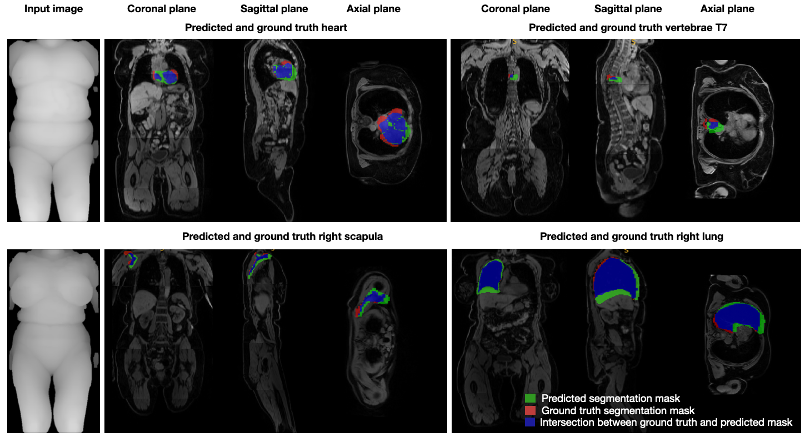

# Depth to Anatomy: Learning Internal Organ Locations from Surface Depth Images

This repository contains the official PyTorch implementation for the paper _Depth to Anatomy: Learning Internal Organ Locations from Surface Depth Images_

## 🫁 What is 'Depth to Anatomy'?

"Depth to Anatomy" is a new AI-based method that can predict the 3D shape and position of internal organs using just a single 2D depth image of a person’s body.
Unlike traditional methods, it doesn’t need extra steps like building a 3D model of the body’s surface or aligning everything to a standard reference.
This makes it much faster and easier to use in real medical settings. The system uses a deep learning model called Pix2Vox and has shown high accuracy in locating different organs.
This could help improve how CT or MRI scans are planned - by automatically positioning the patient correctly without relying on external markers or extra preview scans.
As a result, it could save time, reduce errors, and make the scanning process more consistent across different technicians.

